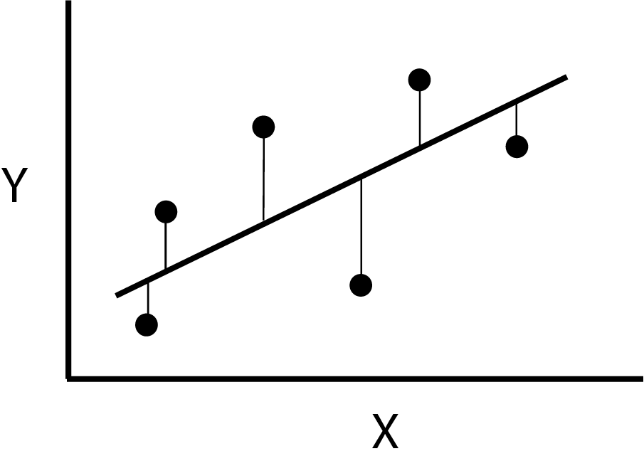
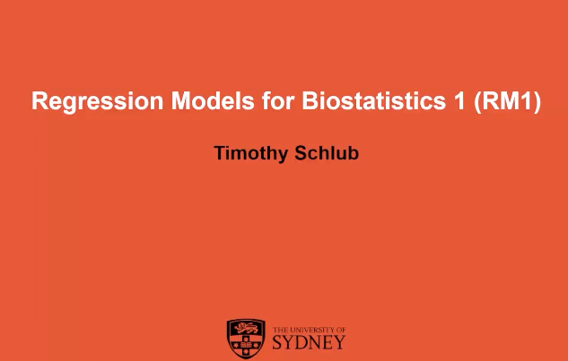

```{r, setup, include=FALSE}
library(ggplot2)
library(Statamarkdown)
stataexe <- "/Applications/Stata/StataBE.app/Contents/MacOS/StataBE"
knitr::opts_chunk$set(engine.path=list(stata=stataexe))
knitr::opts_knit$set(root.dir = 'Data') # Changes the working director to the Data folder
```

# Simple Linear Regression {#slr}

## Learning objectives {#learn_obj_wk01 .unnumbered}

By the end of this week you should be able to:

1.  Describe the different motivations for regression modelling

2.  Formulate a simple linear regression model

3.  Understand the least squares method of parameter estimation and its equivalence to maximum likelihood

4.  Interpret statistical output for a simple linear regression model

5.  Calculate and interpret confidence intervals and prediction intervals for simple linear regression

## Learning activities {#learn_act_wk01 .unnumbered}

This week's learning activities include:

| Learning Activity        | Learning objectives |
|--------------------------|---------------------|
| Video 1                  | 1, 2, 3             |
| Readings                 | 1, 2, 3, 4          |
| Video 2                  | 4, 5                |
| Independent exercises    | 2, 4, 5             |
| Live tutorial/discussion | 2, 4, 5             |

In the notes below when we mention "Book Chapter", the "Book" we are referring to is: **Regression Methods in Biostatistics: Linear, Logistics, Survival, and Repeated Measures Models**, by Vittinghoff et al. (Second Edition). You should be able to obtain a digital copy of the book from the library of your University.

## Introduction to regression {#video_wk01_into .unnumbered}

Regression modelling is one of the key tools that statisticians use to understand and quantify the relationship between an outcome variable, $Y$, (also known as the "dependent" or "response" variable) and one or more covariates, $\mathbf{x}$ (also known as the "predictor", "independent" or "explanatory" variables). It involves constructing a mathematical equation to describe the relationship between these variables, and aims to find the "best fit" to describe how the outcome variable $Y$ changes as a covariate $x$ changes in value. For example, we might be interested in studying how systolic blood pressure changes for every 1kg increase in body weight, or we might want to know how the average haemoglobin levels differ between males and females. Regression models are an extremely useful tool that can be used to answer a variety of research questions and for different purposes (outlined in the video below).

The aim of this unit is to lay the foundation of "regression models" to analyse data from randomised or observational studies. "Regression" is a general term for measuring relationships between an outcome and one or multiple covariates at once, allowing adjustment for confounding (Week/Module 4) and examination of effect modification (Week/Module 6). Regression models are commonly used in health research and being able to implement these methods appropriately and interpret their results are vital skills for you to master to be an effective practitioner of biostatistics . A suite of common regression models will be taught across this unit (Regression Modelling 1 (RM1)) and in the subsequent Regression Modelling 2 (RM2) unit. The skills taught in this unit (and in RM2) will be used for the remainder of your BCA studies (and career in biostatistics).

In RM1 we will be focussing on regression models where the outcome variables are either continuously distributed (linear regression models), or are binary (logistic regression models). RM2 will then expand the logistic regression concepts introduced in RM1 for multinomial and ordinal categorical data, and also include other regression models for count and rate data, and survival models in the framework of generalised linear models.

```{=html}
<!-- 

In future use the following code to embed videos.

<video width="512" height="380"  controls>
    <source src="videos/RM1 Week 1 Lecture 1.mp4" type="video/mp4">
</video>
-->
```

### Introduction to Simple Linear Regression {#wk01_intro_lin_Reg .unnumbered}
::::: grid
::: g-col-9
This lecture introduces you to the purpose of regression models, which can be used to answer three types of research questions: prediction; isolating the effect of a single predictor; and understanding multiple predictors. You will also learn what a simple linear regression looks like, how to interpret the parameters in the model, and learn about the method used to estimate its parameters.
:::

::: g-col-3
<a href="https://www.youtube.com/embed/xxqLq69THAQ" onclick="window.open(this.href, 'videoPopup', 'width=800,height=600'); return false;">  </a>
:::

:::::
### Book Chapter 1. Introduction to section 1.3.3 (pages 1-4). {#reading_wk01_intro .unnumbered}

This reading (pages 1-4 of the textbook) supplements Lecture 1 with a similar motivation for the need for regression models (which they refer to as "multipredictor regression models") to answer three types of research questions:

1.  Prediction - when we want to use certain variables to predict a certain outcome

2.  Isolating the effect of a single predictor/exposure on the outcome (with or without the presence of confounders)

3.  Understanding the effect of multiple predictors/covariates on an outcome

Nothing new is introduced in this reading, but it provides some further examples and its purpose is to allow you to become familiar with the writing style of the textbook that we follow in this course.

### Book Chapter 3. Section 3.3 to 3.3.3 (pages 35-38). {#reading_wk01_sec3_3 .unnumbered}

This reading (pages 35-38 of the textbook) introduces the simple linear regression model and describes how to interpret each parameter of the model. This will be further explored in Lecture 2. It also describes the error term between individual observations and the mean behaviour of the population -- which is important as the [assumptions of linear regression are all about the error term]{.underline} (you will learn more about this over the coming weeks). Stata and R code corresponding to the output in this reading can be found below.

**Stata code and output**

```{stata, collectcode=TRUE, collapse=TRUE }
use hersdata, clear
set seed 90896
sample 10
reg SBP age
```

**R code and output**

```{r, collapse = TRUE}
hers_subset <- read.csv("hers_subset.csv")
lm.hers <- lm(SBP ~ age, data = hers_subset)
summary(lm.hers)
confint(lm.hers)
```

::: callout-note
Here we do not use the complete HERS dataset; rather we take a random sample of 10% of the data. In Stata this is achieved by using `set seed 90896` and `sample 10`.

Here the `set seed 90896` ensures that the random sample is reproducible. i.e. we draw the same random sample each time. As random sampling is hard to replicate across statistical programs, to get the same output in R we needed to take the random sample in Stata and then import this subset of the data into R. A copy of this subset is provided in the data resources titled `hers_subset.csv`
:::

::: {.callout-tip collapse="true"}
## Interpretation of results

Based on the regression output above, we can see that among women with
heart disease, for every one-year increase in age the mean SBP increases by 0.64 mmHg (95%CI: 0.27, 1.01).

(See the video lectures below for a more detailed interpretation)

:::

#### Notation {#notes_wk_01_notation .unnumbered}

Before continuing further with the theory of linear regression it is helpful to see some of the variations in notation around regression formula. In general greek letters are used for true population values, whereas the latin (or modern) alphabet is used to denote estimated values from a sample. The hat symbol (\^) can also be used to indicated estimated or fitted values. Subscripts on the $Y$'s and $x$'s indicate the observation number. Some examples of the different ways regression notation is used in this course is shown below. Don't worry if some of these terms are not familiar to you yet, they will be introduced to you in due course.

+-------------------------------------+-------------------------------------------------------------------------------+------------------------------------------------------------------+
| Term                                | True population                                                               | Estimated from data/sample                                       |
+=====================================+===============================================================================+==================================================================+
| Regression line                     | $\text{E}(Y) =\beta_0 +\beta_1 x$$Y_i = \beta_0 +\beta_1 x_i + \varepsilon_i$ | $\bar {Y_x} = \hat{\beta_0 } + \hat{\beta_1} x$\                 |
|                                     |                                                                               | $\bar {Y_x} = b_0 + b_1 x$\                                      |
|                                     |                                                                               | $\hat{Y}_i = b_0 + b_1 x_i +e_i$                                 |
+-------------------------------------+-------------------------------------------------------------------------------+------------------------------------------------------------------+
| Expected values / means             | $\text{E}(Y)$                                                                 | $\bar{Y}$                                                        |
|                                     |                                                                               |                                                                  |
|                                     | $\text{E}(x)$                                                                 | $\bar{x}$                                                        |
+-------------------------------------+-------------------------------------------------------------------------------+------------------------------------------------------------------+
| Parameters, regression coefficients | $\beta$                                                                       | $\hat{\beta}$ , $b$                                              |
+-------------------------------------+-------------------------------------------------------------------------------+------------------------------------------------------------------+
| Error terms                         | $\varepsilon$ - called "error"                                                | $e$ or $\hat{\varepsilon}$ called "residual" or "residual error" |
+-------------------------------------+-------------------------------------------------------------------------------+------------------------------------------------------------------+
| Variance of error                   | $\sigma^2$, $\text{Var}(\varepsilon)$                                         | Mean square error, MSE, $\hat{\sigma}^2$, $\hat{\text{           |
|                                     |                                                                               | Var}}(\varepsilon)$, $s^2$                                       |
+-------------------------------------+-------------------------------------------------------------------------------+------------------------------------------------------------------+

#### Properties of ordinary least squares {#notes_wk_01_ols .unnumbered}

There are many ways to fit a straight line to data in a scatterplot. Linear regression uses the principle of *ordinary least squares*, which finds the values of the parameters ($\beta_0$ and $\beta_1$) of the regression line that minimise the sum of the squared *vertical* deviations of each point from the fitted line. That is, the line that minimises: $$ \sum(Y_i - \bar{Y}_i)^2 = \sum(Y_i - (\hat{\beta}_0 + \hat{\beta}_1x_i))^2$$

This principle is illustrated in the diagram below, where a line is shown passing near the value of $Y$ for six values of $x$. Each choice of values for $\hat{\beta}_0$ and $\hat{\beta}_1$ would define a different line resulting in different values for the vertical deviations. There is however one pair of parameter values that produces the least possible value of the sum of the squared deviations called the least squares estimate.

{width="50%"}

In the scatterplot below, you can see how the line adjusts to points in the graph. Try *dragging* some of the points, or creating new points by clicking in an empty area of the plot, and see how the equation changes. In particular, notice how moving up and down a point at the extremes of the $x$ scale, affects the fitted line much more than doing the same to a point in the mid-range of the $x$ scale. We will see later that this is the reason for caution when we have outliers in the data.

```{=html}
<head>
    <meta charset="UTF-8">
    <meta name="viewport" content="width=device-width, initial-scale=1.0">
    <title>Interactive Regression Plot</title>
    <style>
        canvas {
            border: 2px solid #333;
            background: #f9f9f9;
            display: block;
            margin: 20px auto;
            cursor: crosshair;
        }
    </style>
</head>
<body>
    <h4><center>Interactive Regression Plot</center></h4>
    <canvas id="canvas" width="640" height="400"></canvas>
    <script>
        window.onload = function() {
            var n = 29;
            var pointSize = 6;
            var drag_point = -1;
            var canvas = document.getElementById("canvas");
            var ctx = canvas.getContext("2d");

            var points = [
                {x: 39*9, y: 144*2}, {x: 45*9, y: 138*2}, {x: 47*9, y: 145*2}, 
                {x: 65*9, y: 162*2}, {x: 46*9, y: 142*2}, {x: 67*9, y: 170*2}, 
                {x: 42*9, y: 124*2}, {x: 67*9, y: 158*2}, {x: 56*9, y: 154*2}, 
                {x: 64*9, y: 162*2}, {x: 56*9, y: 150*2}, {x: 59*9, y: 140*2}, 
                {x: 34*9, y: 110*2}, {x: 42*9, y: 128*2}, {x: 48*9, y: 130*2}, 
                {x: 45*9, y: 135*2}, {x: 17*9, y: 114*2}, {x: 20*9, y: 116*2}, 
                {x: 19*9, y: 124*2}, {x: 36*9, y: 136*2}, {x: 50*9, y: 142*2}, 
                {x: 39*9, y: 120*2}, {x: 21*9, y: 120*2}, {x: 44*9, y: 160*2}, 
                {x: 53*9, y: 158*2}, {x: 63*9, y: 144*2}, {x: 29*9, y: 130*2}, 
                {x: 25*9, y: 125*2}, {x: 69*9, y: 175*2}
            ];

            canvas.onmousedown = function(e) {
                var pos = getPosition(e);
                drag_point = getPointAt(pos.x, pos.y);
                if (drag_point == -1) {
                    points.push(pos);
                    n++;
                    redraw();
                }
            };

            canvas.onmousemove = function(e) {
                if (drag_point !== -1) {
                    var pos = getPosition(e);
                    points[drag_point].x = pos.x;
                    points[drag_point].y = pos.y;
                    redraw();
                }
            };

            canvas.onmouseup = function() {
                drag_point = -1;
            };

            function getPosition(event) {
                var rect = canvas.getBoundingClientRect();
                return {x: event.clientX - rect.left, y: event.clientY - rect.top};
            }

            function getPointAt(x, y) {
                for (var i = 0; i < points.length; i++) {
                    if (Math.abs(points[i].x - x) < pointSize && Math.abs(points[i].y - y) < pointSize)
                        return i;
                }
                return -1;
            }

            function redraw() {
                ctx.clearRect(0, 0, canvas.width, canvas.height);
                drawRegressionLine();
                drawPoints();
            }

            function drawRegressionLine() {
                var sum_x = 0, sum_y = 0, sum_xy = 0, sum_xx = 0, sum_yy = 0;

                for (var i = 0; i < n; i++) {
                    sum_x += points[i].x;
                    sum_y += points[i].y;
                    sum_xy += points[i].x * points[i].y;
                    sum_xx += points[i].x * points[i].x;
                    sum_yy += points[i].y * points[i].y;
                }

                var slope = (n * sum_xy - sum_x * sum_y) / (n * sum_xx - sum_x * sum_x);
                var intercept = (sum_y - slope * sum_x) / n;

                ctx.lineWidth = 3;
                ctx.strokeStyle = 'red';
                ctx.beginPath();
                ctx.moveTo(0, intercept);
                ctx.lineTo(canvas.width, intercept + slope * canvas.width);
                ctx.stroke();

                ctx.fillStyle = "black";
                ctx.font = "bold 18px Arial";
                ctx.fillText(`y = ${intercept.toFixed(2)} + ${slope.toFixed(2)}x`, 20, 30);
            }

            function drawPoints() {
                points.forEach((p, index) => {
                    ctx.beginPath();
                    ctx.arc(p.x, p.y, pointSize, 0, Math.PI * 2, true);
                    ctx.fillStyle = (drag_point === index) ? "orange" : "blue";
                    ctx.fill();
                    ctx.strokeStyle = "black";
                    ctx.stroke();
                });
            }

            redraw();
        };
    </script>
</body>
```

Linear regression uses least squares to estimate parameters because when regression assumptions are met (more on this later) the estimator is the BLUE: the *Best Linear Unbiased Estimator*.

-   Unbiased means that over many repetitions of sampling and fitting a model, the estimated parameter values average out to equal the true "population" parameter value (i.e. $\text{E}[\hat{\beta}_1]=\beta_1$). Having an unbiased estimator does not mean that all parameter estimates are close to the true value---in fact it says nothing about the sample-to-sample variability in the parameter estimates, since that is a precision issue.

-   The "linear" means that the class of estimators are those that can be written as linear combinations of the observations $Y$. More specifically, any linear unbiased estimator of the slope parameter $\beta_1$ can be written as $\sum_{i=1}^n a_iY_i$ where the values of $(a_1,...a_n)$ must be such that $\text{E}(\sum_{i=1}^n a_iY_i)=\beta_1$. This was important when computational power was limited as linear estimators can be easily computed.

-   The "best" component of BLUE says that least squares estimators are best in the sense of having the smallest variance of all linear unbiased estimators. That is, they have the best precision or they are the most efficient.

The mathematical theorem and proof that the least squares estimator is the best linear unbiased estimator (BLUE) is called the *Gauss-Markov theorem*. The least squares estimator is also identical to the maximum likelihood estimator when the regression assumptions are met.

The mathematical theorem and proof that the least squares estimator is the best linear unbiased estimator (BLUE) is called the *Gauss-Markov theorem*. The least squares estimator also identical to the maximum likelihood estimator when the regression assumptions are met.

### Chapter 3. Section 3.3.5 to 3.3.9 (pages 39-42). {#reading_wk01_sec3_3_5 .unnumbered}

The reading describes the basic properties of regression coefficients including: their standard error; hypothesis testing; confidence intervals; and their involvement in the calculation of $R^2$.

## Regression in Stata and R {.unnumbered}

The lecture below (which you can watch for either Stata or R (or both if you are keen)) shows how to carry out and interpret the results of a simple linear regression in statistical software. It then shows how to calculate and interpret confidence and prediction intervals.

::::: grid
::: g-col-6
### Stata Lecture {.unnumbered}

<a href="https://sydney.instructuremedia.com/embed/ffe05595-d38b-441b-914b-f80c0c563e61" onclick="window.open(this.href, 'videoPopup', 'width=800,height=600'); return false;">  </a>
:::

::: g-col-6
### R Lecture {.unnumbered}

<a href="https://sydney.instructuremedia.com/embed/8d25c66e-8446-42aa-8794-444b9438d115" onclick="window.open(this.href, 'videoPopup', 'width=800,height=600'); return false;">  </a>
:::
:::::


::: {.callout-tip collapse="true"}
## Interpretation of results

Based on the regression output above, we can see that among this sample of post-menopausal women with
coronary heart disease, there was strong evidence that age was significantly associated with systolic blood pressure (SBP) (p=0.0007). For every one-year increase in age, the mean SBP increases by 0.64 mmHg (95%CI: 0.27, 1.01 mmHg). However, age only accounts for a small proportion of the overall variability observed in SBP ($R^2=0.04$)

For a person aged 60 years, we expect the **mean** SBP to be 132mmHg (95%CI: 129.11, 135.58).

We expect that, for a 60 year-old, their **individual** SBP measurement will fall between 93.19 to 171.50mmHg with 95% confidence.
:::


## Exercises {#exercise_wk_01_01 .unnumbered}

The following exercise will allow you to test yourself against what you have learned so far. The solutions will be released at the end of the week.

Using the dataset [hers_subset.csv](https://www.dropbox.com/s/t0ml83xesaaazd0/hers_subset.csv?dl=1 "These data are a simple random sample of n=276 observations (10%) from the HERS study. The HERS study was a randomized clinical trial of hormone therapy (estrogen plus progestin) for the reduction of cardiovascular disease risk in post-menopausal women with established coronary disease. Study participants were n=2,763 post-menopausal women with coronary disease and with an intact uterus") dataset, use simple linear regression in R or Stata to measure the association between diastolic blood pressure (DBP - the outcome) and body mass index (BMI - the exposure).

a)  Summarise the important findings by interpreting the relevant parameter values, associated P-values and confidence intervals, and $R^2$ value. Three to four sentences is usually enough here.

b)  From your regression output, calculate by how much the mean DBP changes for a 5kgm^-2^ increase in BMI? Can you verify this by modifying your data and re-running your regression?

c)  Manually calculate the $\beta_1$ standard error, the t-value, p-value and $R^2$

d)  Based on your regression, make a prediction for the mean diastolic blood pressure of people with a BMI of 28kgm^-2^.

e)  Calculate and interpret a confidence interval for this prediction.

f)  Calculate and interpret a prediction interval for this prediction.

## Live tutorial and discussion {.unnumbered}

The final learning activity for this week is the live tutorial and discussion. This tutorial is an opportunity for you to to interact with your teachers, ask questions about the course, and learn about biostatistics in practice. You are expected to attend these tutorials when possible for you to do so. For those that cannot attend, the tutorial will be recorded and made available on Canvas. We hope to see you there!

## Summary {#summary_wk01 .unnumbered}


::: {.callout-tip title="This week’s key concepts are:"}
 -   Regression models have three main purposes: prediction; isolating the effect of a single exposure; and understanding multiple predictors. The purpose of a regression model will influence the procedures you follow to build a regression model, and this will be explored more in week 8.
 - Simple linear regression measures the association between a continuous outcome and a single exposure. This exposure can be continuous, or binary (in which case simple linear regression is equivalent to a two-sample students t-test; See Week 3 notes).
 -   The relevant output to interpret and report from a simple linear regression includes:
        -   The p-value for the exposure's regression coefficient (slope)
        -   The effect size of the exposure regression coefficient and 95% confidence interval
        -   The amount of variation in the outcome explained by the exposure ($R^2$)
-   The confidence interval for a prediction represents the uncertainty associated with an estimated predicted mean. Conversely, the prediction interval represents the uncertainty associated with the spread of observations around the predicted mean.
:::
