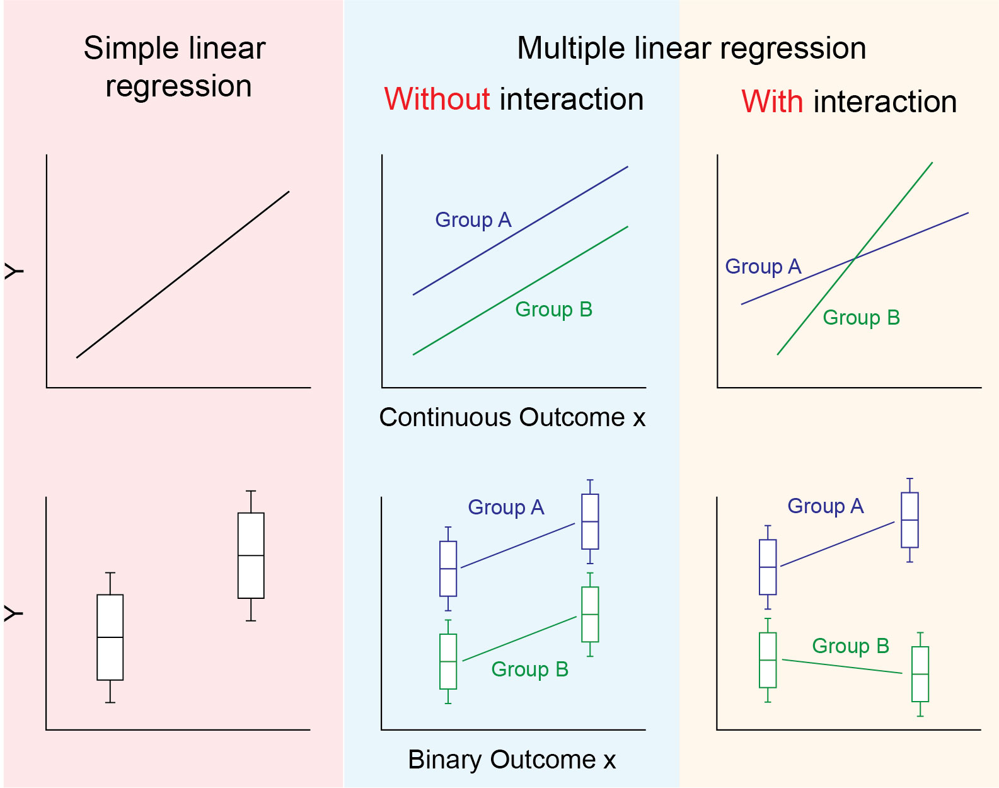

```{r, setup, include=FALSE}
source("setup.R")
```

# Interaction and Collinearity {#interaction_collinearity}

## Learning objectives {#learn_obj_wk06 .unnumbered}

By the end of this week you should be able to:

1.  Understand and explain the concept of interaction (effect modification)

2.  Carry out linear regression analysis that accounts for interaction and interpret the key findings

3.  Understand the concept of collinearity and how it affects linear regression

4.  Implement model building strategies for dealing with collinearity

## Learning activities {#learn_act_wk06 .unnumbered}

This week's learning activities include:

| Learning Activity         | Learning objectives |
|---------------------------|---------------------|
| Reading                   | 1, 2                |
| Collaborative exercise    | 1, 2                |
| Live tutorial/discussion  | 3, 4                |


There are a number of approaches that you can use to detect collinearity:

1. By examining scatterplots

2. By examining the correlation between the predictor variables (e.g., via a correlation matrix)

3. By fitting a series of regressions where the predictor variables are treated as the outcome variable (one at a time) and the other covariates are included as predictors in the model (this is a bit cumbersome)

4. By examining the variance inflation factor (VIF), which can be used to quantify the extent of the collinearity (measures how much a coefficient's variance is inflated due to the presence of correlation between the collinear predictor variables). You can obtain this in R or Stata after fitting your models (a value will be provided for each predictor in the model). See Section 4.2.2.2 (p74) of Vittinghoff et al for more details. Note that different cut-offs have been recommended for the VIF. In general, a VIF = 1 indicates no collinearity. VIFs of 1-5 might indicate that there is potentially some collinearity and should be investigated further. VIFs 5-10 indicate that there is potentially problematic collinearity that should be investigated and VIF>10 often indicates serious collinearity that will need correction.


### Handling collinearity {.unnumbered}

How we handle collinearity depends partly on our research question and the purpose of fitting our regression model (inferential goals from week 1), as well as the degree of collinearity and the variables affected. For example, if we are interested in fitting a prediction model where we are not interested in interpreting individual parameter values of the predictors, then we may include collinear variables if it improves the model's performance (decreases prediction error). However, if we wish to interpret individual parameter values in the model, then we might want to try re-running the analysis with only one of the collinear variables included at a time, and slowly re-introduce the collinear variables into the model (this might involve fitting several models). You could potentially linearly combine some of the correlated variables to generate a new variable (e.g., use BMI instead of including height and weight in a model). Alternatively, you could also choose which variables to include based on what  makes the most sense clinically (based on theory) and/or based on which measures are the easiest/most practical to collect. In some instances you might still need to keep collinear predictor variables in the model, for example, if there are higher order terms in the model such as quadratic terms (e.g., $x^2$; Module 7) or interaction terms (introduced below), or if one variable is a predictor of main interest and the other is an important confounder variable. See Vittinghoff et al. pp421-422 for more examples.

Note that other advanced techniques such as ridge regression may also be used to handle collinearity. These are beyond the scope of RM1.


### Book Chapter 10: Section 10.4.1 (pages 421-422). {#reading_wk6_coll .unnumbered}

This reading (pages 421-422 of the textbook) supplements the notes above.

## Independent Exercise - Collinearity {.unnumbered}

In managing children with asthma and other respiratory diseases, it is important to monitor various measures of lung function, one of the most import of which is the volume of air that can be forced out of the lungs in one second, known as the Forced Expiratory Volume (1 second) or FEV1 for short (measured in litres). The "[lungfun.csv]" dataset contains the following variables:

-   idnum: patient identification number

-   age: age in years

-   wt: weight in kg

-   height: in cm

-   armsp: arm span in cm (the distance between the fingertips of left and right hands when hands outstretched)

-   ulna: ulna length in cm (the ulna is the main bone of the arm below the elbow)

-   farm: forearm length in cm (distance from elbow to the fingertip)

-   fev1: Forced Expiratory Volume in 1 second (L)

Carry out a regression with fev1 as the outcome, and all covariates included (excluding idnum). Describe any collinearity you observe. How would you recommend dealing with this collinearity?

## Interaction (effect modification) {.unnumbered}

In previous weeks we assumed that the true underlying effect of an exposure on an outcome was constant over all individuals. This is not always the case and when the effect of the exposure varies for different groups (or across different values of a covariate) this is called "interaction". For example, a randomised controlled trial (RCT) may find that the effect of antiviral drug A vs antiviral drug B for COVID-19 patients differs between those >65 years compared to those $\le$ 65 years, or the effect of the antiviral drugs may vary with BMI (e.g. drug A less effective than drug B for lower BMIs, but drug A is more beneficial than drug B for higher BMIs). Another term frequently used instead of interaction is "effect modification". We often include "interaction" terms in a regression model to perform "sub-group analyses" in an RCT. You may wish to review your epidemiology notes for more information and examples of interaction.

The panel of images below is a helpful visual representation of the differences in regression models with and without interaction. The first column shows simple linear regression with a single relationship between $x$ and $Y$ (a continuous $x$ is shown in the top 3 panels, and a binary $x$ is shown in the bottom three. The second column shows multiple linear regression as we have used it so far. Here a binary "group" variable is included to adjust for the mean difference in $Y$ across groups A and B. As the two lines are parallel along $x$ the mean difference between groups is constant for all values of $x$. In the third panel, we see that the relationship between $x$ and $Y$ is different for group A and group B. That is, there is interaction between $x$ and the group variable. The lines are not parallel so the mean difference between group A and B depends on the value of $x$.

{width="90%"}

### A regression model for interaction {.unnumbered}

We introduce the mathematical form of the regression model for interaction by considering a regression model with two covariates $x_1$ and $x_2$ which are regressed on our outcome variable $Y$. The equation for this model without interaction is shown below:

$$\text{E}(Y) = \beta_0 +\beta_1 x_1 + \beta_2 x_2$$

The term we add to this model to account for, and test for interaction is the *product* of $x_1$ and $x_2$ as follows:

$$\text{E}(Y) = \beta_0 +\beta_1 x_1 + \beta_2 x_2 + \beta_3 x_1 x_2$$ To see why this works, consider the following factorisations of this regression equation

$$\text{E}(Y) = \beta_0 +\beta_1 x_1 + (\beta_2 + \beta_3 x_1) x_2$$ Here, that the effect of $x_2$ on $Y$ equals $\beta_2 + \beta_3 x_1$. That is the effect of $x_2$ is dependent on the value of $x_1$ - the definition of interaction. Also, you could instead factor out $x_1$ instead of $x_2$ to obtain the following

$$\text{E}(Y) = \beta_0 + (\beta_1 + \beta_3 x_2) x_1 + \beta_2 x_2$$ where we see that the effect of $x_1$ equals $\beta_1 + \beta_3 x_2$. That is, the effect of $x_1$ is dependent on the value of $x_2$.

This factorisation is also useful when considering the interpretation of each of the regression coefficients $\beta_0$, $\beta_1$, $\beta_2$ and $\beta_3$. These are:

-   $\beta_0$: the mean of $Y$ when $x_1 = x_2 = 0$
-   $\beta_1$: the effect of $x_1$ when $x_2 = 0$. i.e. The mean of $Y$ will increase by $\beta_1$ for every one unit increase in $x_1$ when $x_2 = 0$.
-   $\beta_2$: the effect of $x_2$ when $x_1 = 0$. i.e. The mean of $Y$ will increase by $\beta_2$ for every one unit increase in $x_2$ when $x_1 = 0$.
-   $\beta_3$: How the effect of $x_1$ changes for every one unit increase in $x_2$. Or alternatively, how the effect of $x_2$ changes for every one unit increase in $x_1$.

Importantly, the statistical test for an interaction here is the test with the null hypothesis $\beta_3 = 0$. Therefore the P-value for $\beta_3$ should be interpreted as the evidence for an interaction between $x_1$ and $x_2$.

### Interaction in statistical software {.unnumbered}

There are two approaches for implementing an interaction regression model in statistical software. The first is to manually create a new column of data which is the product of the two columns you wish to test for interaction for. You can then include this new variable as a covariate in the regression. The second method is to allow Stata or R to do this automatically, by specifying the interaction in the regression formula. The second method is always recommended as interaction involving categorical variables of more than two categories requires more than just creating a product of two covariates, but instead creating a product of all dummy variables involved in the categorical variable.

#### Stata {.unnumbered}

In Stata the hash symbol `#` is used to specify interaction. E.g. `reg Y x1 x2 x1#x2` would be a regression model with outcome $Y$, covariates $x_1$ and $x_2$ and interaction between $x_1$ and $x_2$. Alternatively you can use the double hash `##` as a shorthand to specify the inclusion of both covariates and interaction between them. i.e. `reg Y x1 x2 x1#x2` is equivalent to `reg Y x1##x2`

Note that you will have to use "c." to specify an interaction between a continuous and categorical variable. For example, you might be specifying an interaction between $treatment$ which is categorical, and $age$ which is continuous. In Stata we would use the command `reg Y i.treatment age i.treatment#c.age`. If you don't include the "c." for the continuous variable in an interaction with a categorical variable, then Stata will incorrectly assume that the continuous variable is categorical.

You should also use the "c." to specify an interaction between two continuous variables in Stata. For example: `reg Y age bmi c.age#c.bmi` (otherwise it will assume they're categorical variables.)

For an interaction between two categorical variables, you should use the "i." for both variables, e.g. `reg Y i.treatment i.sex i.treatment#i.sex`. (Note that you should always use "i." for categorical variables in Stata, even when you're fitting a model that doesn't contain interactions.)

#### R {.unnumbered}

In R the colon symbol `:` is used to specify interaction. E.g. `lm(Y ~ x1 + x2 + x1:x2, data=...)` would be a regression model with outcome $Y$, covariates $x_1$ and $x_2$ and interaction between $x_1$ and $x_2$. Alternatively you can use the star `*` as a shorthand to specify the inclusion of both covariates and interaction between them. i.e. `lm(Y ~ x1*x2, data=...)` is equivalent to `lm(Y ~ x1 + x2 + x1:x2, data=...)`. You could also write this as `lm(Y ~ x1 + x2 + x1*x2, data=...)`.

#### Book Chapter 4. Section 4.6.5 (pages 107-108). {#reading_wk06_sec4_6_5 .unnumbered}

This small reading provides brief descriptions of several important factors to consider when using a regression model with interaction.

### Example {.unnumbered}

We will show two examples from the textbook that demonstrate interaction. These are examples 4.6.1 (interaction between two binary variables) and 4.6.2 (interaction between a binary variable and a continuous variable). You can also of course have interactions between two continuous variables.

#### Example 4.6.1 {.unnumbered}

We return to the HERS dataset with low-density lioprotein (`LDL`) as the outcome and statin use (`statin`) and hormone therapy (`HT`) as the two binary covariates. Note that the results below will differ to those in the text book as the textbook uses `LDL1` as the outcome instead of `LDL`. The regression model with interaction is:

**Stata code and output**

```{stata, collectcode=TRUE, collapse=TRUE }
use hersdata, clear
reg LDL i.HT i.statins  i.HT#i.statins
```

**R code and output**

```{r, collapse = TRUE}
hers <- read.csv("https://raw.githubusercontent.com/atpinto/RM1/main/Data/hersdata.csv")
lm.hers <- lm(LDL ~ HT + statins + HT:statins, data = hers)
summary(lm.hers)
confint(lm.hers)
```

You may notice here that the R and Stata output have some differences as they choose different reference categories for the HT variable (Stata chose the placebo group as the first observation in the dataset is from the placebo group (and the HT variable is coded as 0 = placebo, 1 = hormone therapy), and R chose the hormone therapy group as the reference group "hormone therapy" is before "placebo" when arranging in alphabetical order). In both instances here however the primary result is the same: "There is no evidence of interaction between HT and statin use (P = 0.513)". As there is no evidence for interaction, you would then proceed with a non-interaction regression model.

Note that if your categorical variable(s) involved in the interaction have >2 categories, then you will need to fit two models (one without the interaction and one with the interaction terms) and compare the two models with an F-test or likelihood ratio test to obtain a single p-value for the interation term (see week 4 notes).

#### Example 4.6.2 {.unnumbered}

Using the same HERS data as example 4.6.1 we now investigate possible interaction between statin use (binary variable) and body mass index (BMI - a continuous variable). In this example, we also adjust for several other covariates including `age`, `nonwhite`, `smoking` and `drinkany`. We also use a centered version of the BMI variable. Unlike in example 4.6.1 our results should match the textbook as we both use the `LDL` variable.

**Stata code and output**

```{stata, collectcode=TRUE, collapse=TRUE }
use hersdata, clear
gen BMIc = BMI - 28.57925
regress LDL i.statins##c.BMIc age nonwhite smoking drinkany
```

**R code and output**

```{r, collapse = TRUE}
hers <- read.csv("https://raw.githubusercontent.com/atpinto/RM1/main/Data/hersdata.csv")
hers$BMIc <- hers$BMI - 28.57925
lm.hers <- lm(LDL ~ statins*BMIc + age + nonwhite + smoking + drinkany, data = hers)
summary(lm.hers)
confint(lm.hers)
```

We can see from the output above that there is strong evidence for interaction between body mass index and statin use, after adjusting for age, nonwhite, smoking, and drinkany covariates (P = 0.009). Given the strong evidence for interaction, we would decide to keep interaction in this model. This makes the interpretation of the base `statins` and `BMIc` variables different as follows:

-   `statins`. When BMIc = 0, the those taking statins have a LDL on average 16.25mg/dL lower than those not taking statins. Here we can see the value of centering BMI, as BMIc = 0 corresponds to the effect of statin use for the mean BMI of this sample. Otherwise it would correspond to the effect of statins for a BMI of 0 (which is not appropriate to calculate)

-   `BMIc`. For those not taking statins (i.e. statins = 0), for every 1kg/m^2^ increase in BMI, the mean LDL increases by 0.58mg/dL.

To calculate the mean effect of BMI on those taking statins, we would need to take linear combinations of the above regression coefficients. In this case the mean effect would be 0.58 - 0.70 = -0.12. To get a more accurate calculation of this, along with the corresponding confidence interval use the `lincom BMIc + 1.statins#c.BMIc` statement in stata and the `summary(glht(lm.hers, "BMIc + statinsyes:BMIc = 0"))` command in R (you can swap "summary" with "confint" in this statement to obtain the confidence intervals).

#### Additional Independent Exercise (optional) {.unnumbered}

Try using the HERS dataset to explore other interactions, e.g., between statins and smoking, between age and statins. Are the interactions significant? Write out the regression equation and interpret each regression parameter. Feel free to post your findings on the Week 6 discussion board.

## Summary {.unnumbered}

::: {.callout-tip title="This week’s key concepts are:"}
1.  Collinearity occurs when two or more covariates/predictor variables in a regression model are associated with each other, and do not have sufficient independent associations with the outcome

2.  Collinearity increases standard errors of regression coefficients, can lead to unstable estimates of the regression coefficients, can cause difficulty in interpretation of model results, and may contribute to overfitting in some settings. In some situations though, it may be ok to have collinearity present in the model.

3.  You should check for collinearity when carrying out linear regression. If detected, the effects of collinearity can be determined by removing some of the collinear covariates and/or by examining the VIF.

4.  Interaction between two covariates occurs when the effect size for variable 1, depends on the level of covariate 2. This is also called effect modification.

5.  Interaction between two variables in regression can be tested by including an additional covariate in your regression model that is the multiplication of your two covariates. If one or more of these covariates is categorical (with more than 2 categories), this will be the addition of several interaction terms between all dummy variables.

6.  The interpretation of regression models with interaction terms is more complex as the effect sizes are not constant for interacting covariates (depend on the level of the other covariate involved in the interaction).
:::